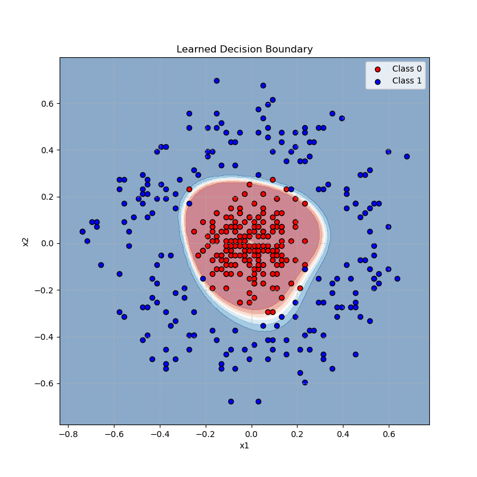
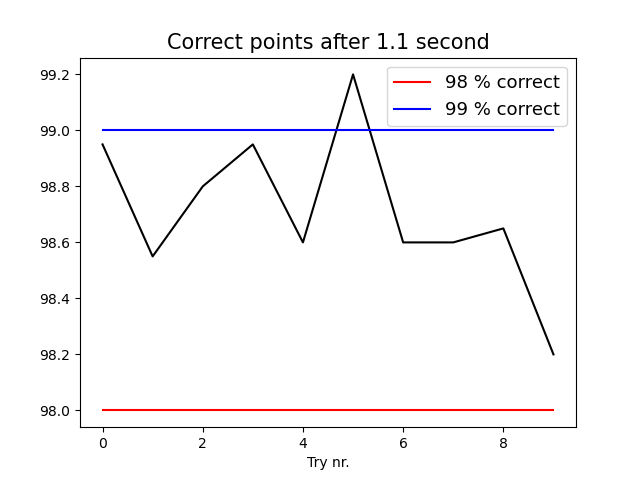

# Neural Network as an ODE Solver (ResNet from Scratch)

[](https://www.python.org/)
[](https://numpy.org/)
[](https://matplotlib.org/)

This project implements a deep neural network from scratch, framing the layers as the numerical solution to an Ordinary Differential Equation (ODE). This approach is analogous to a **Residual Network (ResNet)** and is used here to solve a classic non-linearly separable classification problem: distinguishing between two concentric circles of data points.

<div align="center">
    
</div>

*The learned decision boundary correctly separating the two classes of data points.*

---

## Key Features & Architecture

This is not a standard feed-forward network. It uses several advanced concepts:

*   **ODE-based Architecture (ResNet Analogy):** The forward pass is not a simple series of matrix multiplications. Instead, it's an **Euler method** that solves an ODE over a set number of "time" steps.

*   **Analytical Gradient Calculation:** The model uses analytical gradients for training, implementing **backpropagation-through-time** to calculate the derivatives of the objective function.

*   **Feature Engineering:** To make the problem linearly separable, the input data `(x1, x2)` is mapped to a 4D feature space `(x1, x2, x1^2, x2^2)` before being passed into the network.

*   **Gradient Descent with Line Search:** The training algorithm uses a variable learning rate, performing a line search at each step to find a step size that satisfies a sufficient decrease condition (Armijo-like rule).

<div align="center">
    
</div>

*Accuracy results over 10 independent training runs, each limited to 1.1 seconds.*

---

## How to Run

1.  **Clone the repository:**
    ```sh
    git clone https://github.com/your-username/your-repo-name.git
    cd your-repo-name
    ```

2.  **Install dependencies:**
    ```sh
    pip install -r requirements.txt
    ```

3.  **Run the tester script:**
    This script will train the network 10 times, test its accuracy, and generate a plot of the results.
    ```sh
    python tester.py
    ```